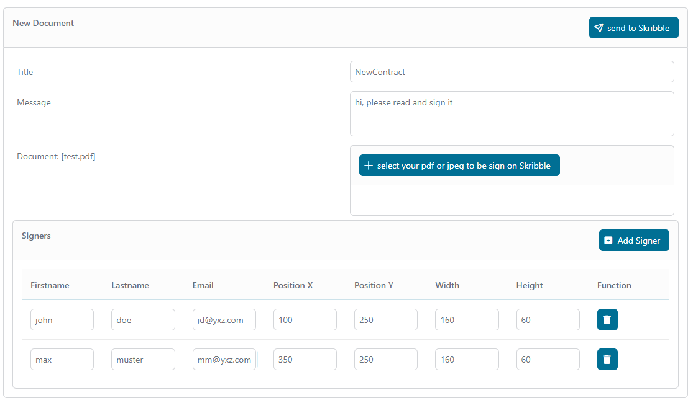
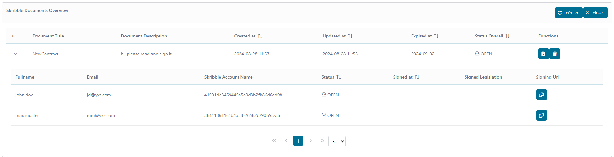
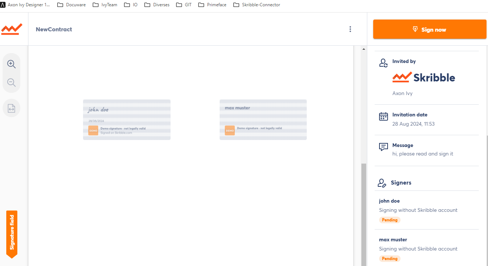
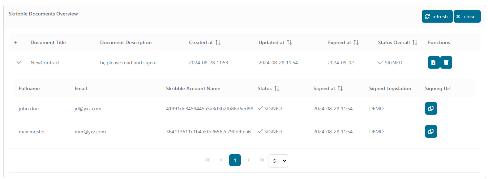

# Skribble-Connector

[Skribble](https://www.skribble.com/de-de/) ist eine moderne Plattform für
digitale Signaturen, die rechtsverbindliche elektronische Signaturen gemäß den
europäischen Gesetzen bereitstellt. Nutzen Sie unseren Skribble-Konnektor, um
Zugriff auf die Skribble-Funktionen zu erhalten, wie z. B.

- Erstellen von Signaturen auf sichere und rechtskonforme Weise
- Überwachung von Signaturprozessen

Laden Sie einfach den Connector in Ihren Axon Ivy Designer herunter und starten
Sie den Demo-Prozess!

## Demo

Über die Demo können neue Signaturanfragen erstellt und überwacht werden. Wenn
eine Signaturanfrage erstellt wird, wird die Signaturüberprüfung über die
Plattform abgewickelt. Jeder Teilnehmer hat vollen Zugriff auf seine eigenen
Dokumente und kann diese unterzeichnen oder ablehnen.

In der Demo gibt es zwei Prozesse: Der erste Prozess ist ein einfacher Dialog
zum Erstellen einer neuen Signaturanforderung, und der zweite zeigt alle
Signaturanforderungen mit ihrem jeweiligen Status an.

Erstellen Sie eine neue Signaturanforderung, laden Sie Ihr zu signierendes
Dokument hoch und fügen Sie Ihren Unterzeichner hinzu.


Lädt alle Ihre Dokumente von der Skribble-Plattform. Wenn Sie erfolgreich eine
Anfrage erstellt haben, wird diese hier angezeigt. 

Dokumentansicht auf der Skribble-Plattform als Unterzeichner


Aktualisieren Sie die Übersichtsseite, und Sie werden sehen, dass sich der
Status des Unterzeichners und der Gesamtstatus geändert haben.


Um eine Unterschrift von einem Unterzeichner zu erhalten, gibt es zwei einfache
Möglichkeiten: - Setzen Sie den Benachrichtigungsparameter des Unterzeichners
auf „true” und er erhält kurz nach der Anfrage direkt eine E-Mail von der
Skribble-Plattform. - Wenn Sie ihn selbst benachrichtigen möchten, können Sie
die Benachrichtigung deaktivieren und ihm die URL über Ihre eigene, individuell
gestaltete E-Mail senden.

Es gibt drei Optionen für die Signaturüberprüfung: SES, AES und QES.


## Setup

Bevor Signaturvorgänge zwischen den Diensten „ **” (Axon Ivy Engine,** ) und „
**” (Skribble-Plattform,** ) ausgeführt werden können, müssen diese Dienste
einander vorgestellt werden. Dies kann wie folgt erfolgen:

1. Erstellen Sie ein **-Konto** -Konto:
   **[hier](https://my.skribble.com/business/signup/?lang=en) **

2. ** Erstellen Sie einen Demo-API-Schlüssel unter **. Weitere Informationen
   finden Sie in der Admin-Dokumentation:
   **[hier](https://docs.skribble.com/business-admin/api/apicreate#create-api-keys).
   **

3. Öffnen Sie die Datei „ `Configuration/variables.yaml”` in Ihrem Designer und
   legen Sie den Benutzernamen und den API-Schlüssel fest, die Sie auf der
   Skribble-Plattform erhalten haben.

   ```
    # == Variables ==
    Variables:
      #set all paramaters for Skribble-connector
      skribbleConnector:
        #username
        username: 'api_demo_xxxxx'   #<-- paste here your username
        #apikey
        #[password]
        authKey: ${decrypt:\u00AF\u00A8...}   #<-- paste here your apikey and encrypt it

   ```

4. Speichern Sie die geänderten Einstellungen und starten Sie einen
   Demo-Prozess.
